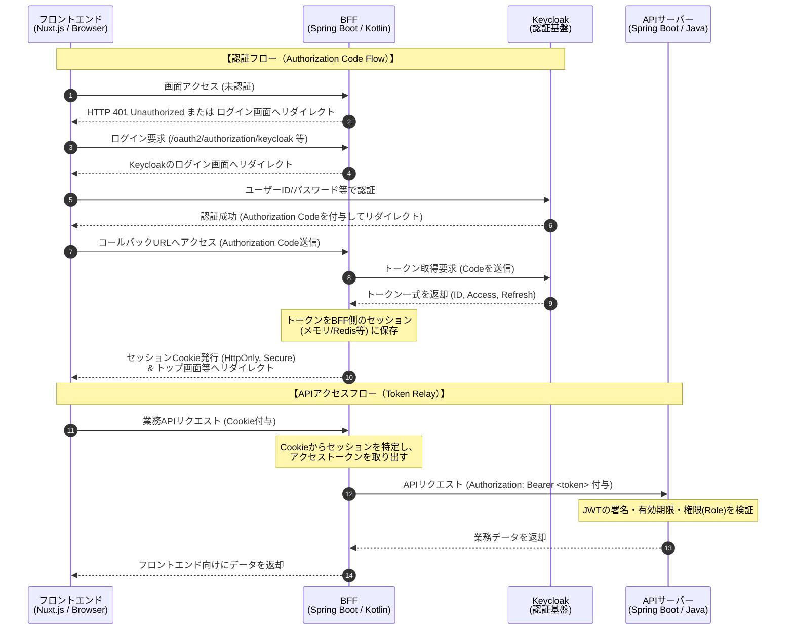

# 認証・認可アーキテクチャ仕様 (Keycloak OIDC連携)

## 1. 基本方針 (BFF パターン)
セキュリティリスクを最小限に抑えるため、ブラウザ（Nuxt.js）にはアクセストークン（JWT）を直接露出させない「BFF（Backend For Frontend）パターン」を採用する。

## 2. 各コンポーネントの責務

### 2.1. フロントエンド (Nuxt.js)
- **トークン非保持**: アクセストークンやリフレッシュトークンは一切保持しない。
- **セッション管理**: BFFが発行するセッション Cookie (`HttpOnly`, `Secure`, `SameSite=Strict` 推奨) を用いて認証状態を維持する。
- **ログイン要求**: 未認証時（HTTP 401応答時など）は、BFFのログインエンドポイント（例: `/login`）へリダイレクトする。

### 2.2. BFF (Spring Boot / Kotlin / WebFlux)
- **OIDC クライアント**: Keycloak に対する OIDC クライアント（Relying Party）として振る舞う。
- **認証フロー制御**: `Authorization Code Flow` を実行し、Keycloak からアクセストークン、IDトークン、リフレッシュトークンを取得する。
- **セッション管理**: 取得したトークンをBFF側のセッション（インメモリ、または Redis 等）に紐付けて管理し、フロントエンドにはセッション Cookie を発行する。
- **Token Relay**: フロントエンドからの API リクエストを API サーバーへプロキシする際、セッションからアクセストークンを取り出し、`Authorization: Bearer <token>` ヘッダとして付与（Token Relay）する。

### 2.3. API サーバー (Spring Boot / Java / 4層クリーンアーキテクチャ)
- **ステートレス**: セッションは持たず、リクエストごとにトークンを検証する（Resource Server として振る舞う）。
- **トークン検証**: BFFから渡された JWT アクセストークンの署名（JWKSによる検証）、有効期限、発行者(Issuer)の検証を行う。
- **認可 (Authorization)**: JWT 内のカスタムクレーム（Keycloak の Client Roles または Realm Roles）を読み取り、エンドポイントごとに必要な権限（例: `@PreAuthorize("hasRole('ADMIN')")`）を判定する。

## 3. 認証シーケンス概要

