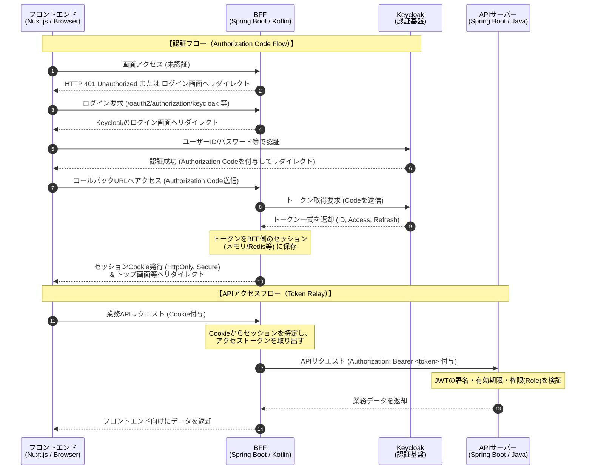

# 認証・認可アーキテクチャ仕様 (Keycloak OIDC連携)

## 1. 基本方針 (BFF パターン)
セキュリティリスクを最小限に抑えるため、ブラウザ（Nuxt.js）にはアクセストークン（JWT）を直接露出させない「BFF（Backend For Frontend）パターン」を採用する。

## 2. 各コンポーネントの責務

### 2.1. フロントエンド (Nuxt.js)
- **トークン非保持**: アクセストークンやリフレッシュトークンは一切保持しない。
- **セッション管理**: BFFが発行するセッション Cookie (`HttpOnly`, `Secure`, `SameSite=Strict` 推奨) を用いて認証状態を維持する。
- **ログイン要求**: 未認証時（HTTP 401応答時など）は、BFFのログインエンドポイント（例: `/login`）へリダイレクトする。

### 2.2. BFF (Spring Boot / Kotlin / WebFlux)
- **OIDC クライアント**: Keycloak に対する OIDC クライアント（Relying Party）として振る舞う。
- **認証フロー制御**: `Authorization Code Flow` を実行し、Keycloak からアクセストークン、IDトークン、リフレッシュトークンを取得する。
- **セッション管理**: 取得したトークンをBFF側のセッション（インメモリ、または Redis 等）に紐付けて管理し、フロントエンドにはセッション Cookie を発行する。
- **Token Relay**: フロントエンドからの API リクエストを API サーバーへプロキシする際、セッションからアクセストークンを取り出し、`Authorization: Bearer <token>` ヘッダとして付与（Token Relay）する。

### 2.3. API サーバー (Spring Boot / Java / 4層クリーンアーキテクチャ)
- **ステートレス**: セッションは持たず、リクエストごとにトークンを検証する（Resource Server として振る舞う）。
- **トークン検証**: BFFから渡された JWT アクセストークンの署名（JWKSによる検証）、有効期限、発行者(Issuer)の検証を行う。
- **認可 (Authorization)**: JWT 内のカスタムクレーム（Keycloak の Client Roles または Realm Roles）を読み取り、エンドポイントごとに必要な権限（例: `@PreAuthorize("hasRole('ADMIN')")`）を判定する。

## 3. 認証シーケンス概要

## 4. BFFの実装ガイドライン (Spring Boot 4.x / Kotlin 2.4.x / WebFlux)

Cline による実装時は、以下の標準的なアプローチを採用すること。独自に複雑なフィルターやトークンパース処理を実装しないこと。また、Java風の `Mono`/`Flux` を直接操作するコードは極力避け、**Kotlin コルーチン (`suspend` 関数) と Kotlin DSL** を積極的に活用すること。

### 4.1. OIDCログインとセッション管理
- `spring-boot-starter-oauth2-client` を利用し、Keycloak との OIDC 連携を行う。
- セキュリティ設定は、Spring Security の **Kotlin DSL (`ServerHttpSecurity.invoke { ... }`)** を用いて記述し、`oauth2Login { }` を有効化する。
- 取得したトークンは Spring Security の標準機能によって WebSession (BFF側) に保持させる。当面はインメモリセッションとし、Redis等は必要になった段階で導入する。
- セッション Cookie の属性は、原則 `application.yml` の `server.reactive.session.cookie.*` プロパティで設定する。
  - `http-only: true`
  - `secure: true` (ローカル開発環境の HTTP 通信時はブラウザ仕様に応じて適宜オフにするか、localhost を用いる)
  - `same-site: strict`

### 4.2. Token Relay (API呼び出し時のトークン付与)
- APIサーバーへの通信には、リアクティブな `WebClient` を使用する。
- リクエストヘッダへのアクセストークン（Bearer）付与、および有効期限切れ時のリフレッシュトークンを用いた自動再取得は、Spring Security が提供する `ServerOAuth2AuthorizedClientExchangeFilterFunction` を `WebClient` に組み込むことで実現し、自作のロジックは極力排除する。
- `WebClient` の呼び出し時は、`awaitExchange()` や `awaitBody()` などの **コルーチン拡張関数** を使用し、非同期処理を同期的に（フラットに）記述すること。

### 4.3. フロントエンドとの通信境界 (CORS)
- Nuxt と BFF が別ポートで動くローカル開発環境において Cookie をやり取りするため、BFF 側で適切な CORS 設定（`Allow-Credentials: true` および `Allowed-Origins` の指定）を行うこと。これも Kotlin DSL (`cors { }`) を用いて設定する。