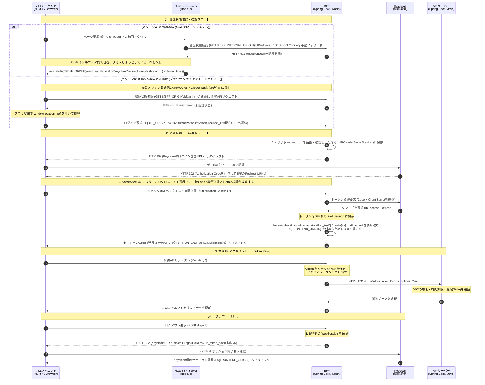

# Keycloak OIDC 認証・認可仕様書

## 1. 基本方針 (BFF パターン)

セキュリティリスクを最小限に抑えるため、ブラウザ（Nuxt.js）にはアクセストークン（JWT）を直接露出させない「BFF（Backend For Frontend）パターン」を採用する。

## 2. Keycloak 接続定義・命名規則

本システムで利用する Keycloak の設定値は以下の命名規則に従う。環境ごとの差異は環境変数で吸収する。

| 項目                      | 命名規則 / 設定値                          | 補足                                                                                      |
| :------------------------ | :----------------------------------------- | :---------------------------------------------------------------------------------------- |
| **Realm名**               | `lumina`                                   | 各環境共通                                                                                |
| **Client ID**             | `lumina-bff`                               | BFF識別用ID                                                                               |
| **Client Authentication** | `ON` (Confidential Client)                 | クライアントシークレットを必須とする                                                      |
| **Redirect URI**          | `${BFF_ORIGIN}/login/oauth2/code/keycloak` | 認証成功後のBFFコールバック先<br>(例: `http://localhost:8080/login/oauth2/code/keycloak`) |

> 💡 **環境変数の定義（3系統・用途厳守）**
>
> 本設計ではブラウザ・Nuxt SSRサーバー・BFFが異なるネットワーク経路で通信するため、以下の3つの環境変数を**用途別に明確に分離**して定義すること。名称を混同・使い回ししないこと。
>
> | 変数名                | 例                                              | 用途                                                                                                                                                         | 参照する主体                                                     |
> | :-------------------- | :---------------------------------------------- | :----------------------------------------------------------------------------------------------------------------------------------------------------------- | :--------------------------------------------------------------- |
> | `FRONTEND_ORIGIN`     | `http://localhost:3000`                         | ブラウザから見たフロントエンドの公開アドレス。BFFがログイン成功後・ログアウト後にリダイレクトする戻り先として使用                                            | BFF                                                              |
> | `BFF_ORIGIN`          | `http://localhost:8080`                         | **ブラウザから見た** BFFの公開アドレス。Keycloak の Redirect URI 登録値、およびブラウザが直接遷移する `/oauth2/authorization/keycloak` 等のURL組み立てに使用 | BFF（Keycloak Client設定）、Nuxt（ブラウザ向けリダイレクト生成） |
> | `BFF_INTERNAL_ORIGIN` | `http://bff:8080`（Docker Composeのサービス名） | **Nuxt SSRサーバー（コンテナ内）から見た** BFFのアドレス。`GET /bff/auth/me` 等のサーバー間通信専用                                                          | Nuxt（SSRコンテキストのみ）                                      |
>
> 🚨 **注意**: `BFF_ORIGIN`（ブラウザ向け・ホスト公開ポート）と `BFF_INTERNAL_ORIGIN`（コンテナ間通信用・Dockerサービス名）を混同すると、WSL2 + Docker Compose環境において「SSR時は `http://localhost:8080` がNuxtコンテナ自身を指してしまいBFFに到達しない」「ブラウザ時は `http://bff:8080` がホストのブラウザから名前解決できない」という**双方向の到達不能障害**が発生する。用途を厳守すること。

> 💡 **BFFのベースパス方針**
> BFFが提供するコントローラは `/bff` プレフィックスを付与し、`spring.webflux.base-path` で管理する。ただし、以下のエンドポイントはベースパス適用の例外としてルート直下に配置する。
>
> 1. **運用系エンドポイント**: `GET /health`

## 3. 認証シーケンス (Authorization Code Flow)



> ※ **アーキテクチャ上の注意**: パターンAにおいて、BFFからの401レスポンスは一度 `Nuxt SSR Server`（Node.js）が受け取ります。ブラウザが直接401を受け取るわけではないため、SSRミドルウェア側で適切にハンドリングし、ブラウザに対して `${BFF_ORIGIN}` を用いた絶対URLでのリダイレクト応答を返してください。

## 4. 各コンポーネントの詳細仕様

### 4.1. BFFにおけるセッション・Cookie管理方式

BFF（Spring Boot）は、認証成功後に以下の仕様でセッション Cookie を発行し、認証状態を維持する。

- **Cookie名**: `SESSION` （Spring Security WebFlux のデフォルト）
- **有効期限 (Max-Age)**: 明示的な有効期限は設定しない（ブラウザを閉じたら破棄されるセッションクッキー）。
- **サーバー側セッションのタイムアウト**: アイドル状態（無操作）が **30分** 継続した場合、サーバー側でセッションを破棄する。
- **セキュリティ属性**:
  - `HttpOnly`: `true` （JavaScriptからのアクセスを完全禁止。XSS対策）
  - `Secure`: `true` （HTTPS通信時のみ送信。ただしローカル開発時は localhost のみ HTTP を許容）
  - `SameSite`: `Lax` （**🚨最重要:** `Strict` にするとKeycloakからBFFに戻るリダイレクト時にCookieが送信されず、state/nonce検証が破損するため、必ず `Lax` とすること）

### 4.2. CSRF（クロスサイトリクエストフォージェリ）対策

Cookieベースのセッション管理に伴うリスクを排除するため、状態変更を伴うリクエスト（POST/PUT/DELETEおよび `/logout`）に対してCSRF保護を行う。

- **方式**: Spring Security WebFlux 標準の `CookieServerCsrfTokenRepository` を使用した Double Submit Cookie パターンを採用する。
- **Cookie名**: `XSRF-TOKEN` (JavaScript からの読み取りを許可するため `HttpOnly: false` とする)
- **ヘッダ名**: `X-XSRF-TOKEN`
- **フロントエンドの対応**: Nuxt側は、BFFから発行された `XSRF-TOKEN` Cookie の値を読み取り、状態変更リクエストの送信時に `X-XSRF-TOKEN` ヘッダに付与して通信すること。
- **🚨 重要な実装要件**:
  1. **遅延発行の回避**: `CookieServerCsrfTokenRepository` はデフォルトで遅延発行（実際にトークンが読み取られた時点で初めてレスポンスにCookieがセットされる）の挙動を持つ。`GET /bff/auth/me` の処理内（または共通WebFilter内）で `CsrfToken` を明示的にsubscribe/読み取りさせる実装とし、確実にレスポンスへ `XSRF-TOKEN` Cookieが書き込まれるように制御すること。
  2. **Pathの固定**: プレフィックス付きリクエスト（`/bff/*`）とSecurityフィルターが直接処理するリクエスト（`/oauth2/*`, `/logout`）の間でCSRFトークンを正しく共有できるよう、CSRF Cookie の Path 属性は必ず `/`（ルート）に明示的に固定すること。
  3. **CORSとの整合**: ブラウザからの通信時、`X-XSRF-TOKEN` ヘッダがCORSポリシーでブロックされないよう、5.4のCORS設定の `AllowedHeaders` に必ず含めること。

### 4.3. 認証状態確認用エンドポイントの定義

Nuxt 4（フロントエンド）が画面レンダリング前やミドルウェアのタイミングで、現在のログイン状態を確認するための軽量なAPIをBFFに定義する。

- **パス**: `GET /bff/auth/me`
- **レスポンス（認証済み時 - HTTP 200 OK）**:
  ```json
  {
    "authenticated": true,
    "userId": "user-12345",
    "username": "taro.yamada",
    "roles": ["USER", "ADMIN"]
  }
  ```
- **レスポンス（未認証時 - HTTP 401 Unauthorized）**:
  ```json
  {
    "authenticated": false,
    "message": "Unauthorized"
  }
  ```

#### 💡 Nuxt 4 (SSR/CSR) でのハンドリングおよびディープリンク復帰仕様

Nuxt 4 はデフォルトで SSR (Server-Side Rendering) を行うため、未認証検知は以下の2つのコンテキストを想定する。**それぞれ呼び出し先のBFFアドレスが異なる点に注意すること。**

1. **SSR時 (Node.js サーバーサイドで実行時)**:
   - `app/middleware/auth.global.ts` などのグローバルミドルウェアで、**サーバー間通信用の `${BFF_INTERNAL_ORIGIN}`** を用いて `GET /bff/auth/me` を呼び出す。この際、ブラウザから受け取った `SESSION` Cookie を Node.js から BFF へのリクエストに手動でフォワード（ヘッダを引き継ぎ）する必要がある。
   - 未認証（401）を検知した場合は、現在アクセスしようとしている本来のパス（例: `/dashboard`）を退避させるため、**ブラウザ向けの公開アドレスである `${BFF_ORIGIN}`** を用いて以下の通り絶対URLでリダイレクトすること。
     ```javascript
     navigateTo(
       `${runtimeConfig.public.bffOrigin}/oauth2/authorization/keycloak?redirect_uri=${encodeURIComponent(to.fullPath)}`,
       { external: true }
     );
     ```
2. **CSR時 (ブラウザサイドでの画面遷移・API実行時)**:
   - `GET /bff/auth/me` の呼び出し、および401検知後の遷移は、**いずれも `${BFF_ORIGIN}`（`runtimeConfig.public.bffOrigin`）** を用いる。
     ```javascript
     window.location.href = `${runtimeConfig.public.bffOrigin}/oauth2/authorization/keycloak?redirect_uri=${encodeURIComponent(window.location.pathname)}`;
     ```
   - `runtimeConfig.public.bffOrigin` は `nuxt.config.ts` の `runtimeConfig.public` に定義し、環境変数 `BFF_ORIGIN` の値を注入すること。SSR用の `BFF_INTERNAL_ORIGIN` は非公開の `runtimeConfig`（`public` 配下ではない）に定義し、ブラウザにバンドルされないようにすること。

### 4.4. ログアウトおよびトークン失効時の挙動

- **通常のログアウト**: フロントから BFF の `/logout`（POST）が叩かれた際、BFF は自身の `WebSession` を破棄し、Keycloak 側のセッションも同時に終了させるため **RP-Initiated Logout** を実行する。この際、Spring Security の標準機能によって `id_token_hint` が自動付与される。ログアウト後の着地先は `setPostLogoutRedirectUri("${FRONTEND_ORIGIN}/")` を用いて、フロントエンドのオリジンを指す絶対URLに固定する（相対パス指定は禁止。理由は5.1参照）。
- **トークン・セッション双方が失効した場合**:
  - `WebClient` による API 呼び出し時に、アクセストークンだけでなくリフレッシュトークンも失効（Keycloak側でセッション切れ等）していた場合、Spring Security のフィルターは自動的にセッションを未認証状態としてマークする。
  - BFF側では、このトークンリフレッシュ失敗に伴う例外ハンドリングとして、Securityの `ServerAuthenticationEntryPoint` を用いて、フロントエンドへ明確に **HTTP 401 Unauthorized** を返却するように統一する。フロントエンドはこの401をトリガーに上記の再ログインフローへ誘導する。

---

## 5. BFFの実装ガイドライン (Spring Boot 4.x / Kotlin 2.4.x / WebFlux)

Cline による実装時は、以下の標準的なアプローチを採用すること。独自に複雑なフィルターやトークンパース処理を実装しないこと。また、Java風の `Mono`/`Flux` を直接操作するコードは極力避け、**Kotlin コルーチン (`suspend` 関数) と Kotlin DSL** を積極的に活用すること。

### 5.1. OIDCログインとセッション・タイムアウト・動的リダイレクト設定

- `spring-boot-starter-oauth2-client` を利用し、設定は Spring Security の **Kotlin DSL (`ServerHttpSecurity.invoke { ... }`)** にて `oauth2Login { }` および `logout { }` を有効化する。
- セッション Cookie の属性は `application.yml` の `server.reactive.session.cookie.*` で管理する。
- 🚨 **セッションタイムアウト設定の厳格化**:
  現状（初期リリースおよびローカル開発環境）ではインメモリセッションを採用するため、**`server.reactive.session.timeout=30m`** を設定すること。将来的にRedis等の外部データストアへ水平スケール（`Spring Session Data Redis` 等の導入）するまでは、`spring.session.timeout` などの別モジュール用プロパティを混在・誤設定させないよう注意すること。
- 🚨 **ディープリンク復帰のためのリダイレクトハンドラ実装**:
  - Nuxt から渡される `/oauth2/authorization/keycloak?redirect_uri=...` のクエリを処理するため、BFF側でログイン開始時に `redirect_uri` の値を短命な一時Cookie（`POST_LOGIN_REDIRECT_URI`）に退避するカスタムフィルターまたはカスタム `ServerAuthorizationRequestRepository` を実装する。
  - **フィルターの登録順序**: このクエリパラメータを読み取るカスタムフィルターは、Spring Security 標準の `OAuth2AuthorizationRequestRedirectWebFilter`（Keycloakへの302を発行する標準フィルター）**より前**にフィルターチェーン上で実行されるよう順序を制御すること。順序が逆になると、クエリを読み取る前に標準フィルターがリダイレクトを完了させてしまう。
  - **認証成功後のリダイレクト実装箇所**: 認証成功時に呼び出される **`ServerAuthenticationSuccessHandler` をカスタム実装**し、`POST_LOGIN_REDIRECT_URI` Cookieに値が存在する場合はそのパスへ、存在しない場合はデフォルトの `${FRONTEND_ORIGIN}/` へリダイレクト（HTTP 302）させる動的制御を行うこと。
  - **絶対URLでのリダイレクト（必須）**: 上記ハンドラが生成する `Location` ヘッダーは、必ず環境変数 `${FRONTEND_ORIGIN}` を用いた絶対URL（例: `${FRONTEND_ORIGIN}/dashboard`）とすること。相対パス（`/dashboard`）を指定してはならない（BFF自身のオリジンとして解決され、フロントエンドに到達しないため）。
- **🚨 リダイレクト先検証（オープンリダイレクト対策・必須）**:
  `redirect_uri` パラメータは以下のバリデーションを必須とする。いずれかに該当する場合は拒否し、デフォルトの `${FRONTEND_ORIGIN}/` にフォールバックすること。
  1. `/` から始まる相対パスであること（それ以外は拒否）。
  2. `//`（プロトコル相対URL）で始まる値は拒否。
  3. `http://`、`https://` を含む値は拒否。
  4. **`\`（バックスラッシュ）を含む値は拒否**（一部ブラウザが `\` を `/` と同一視して解釈し、`//evil.com` 相当に変換されるバイパス手法があるため）。
  5. 制御文字を含む値は拒否。
- **一時Cookie (`POST_LOGIN_REDIRECT_URI`) の属性**:
  - `HttpOnly`: `true`
  - `SameSite`: `Lax`（`SESSION` Cookieと同じ理由。クロスサイト遷移をまたいでKeycloakからのコールバック時に読み取る必要があるため）
  - `Secure`: 4.1の `SESSION` Cookieと同一方針（本番環境では `true`。ローカル開発時のlocalhost例外も同様）
  - 有効期限: 5分程度の短命Cookieとする

### 5.2. Token Relay (API呼び出し時のトークン付与)

- APIサーバーへの通信には、リアクティブな `WebClient` を使用する。
- リクエストヘッダへのアクセストークン（Bearer）付与、および有効期限切れ時の自動リフレッシュは、Spring Security が提供する `ServerOAuth2AuthorizedClientExchangeFilterFunction` を `WebClient` に組み込むことで実現する。
- `WebClient` の呼び出し時は、`awaitExchange()` や `awaitBody()` などの **コルーチン拡張関数** を使用し、非同期処理をフラットに記述すること。

### 5.3. 実装スコープに関する制約

- **APIサーバー側（Java/リソースサーバー）のスコープ外定義**:
  APIサーバー側がリソースサーバーとしてJWTを検証する設定（`spring-boot-starter-oauth2-resource-server` など）は、**本ドキュメントおよび本実装タスクの対象外（別Issue）** とする。Clineによる実装時は、BFF（`bff/` ディレクトリ配下）の実装に完全に集中し、APIサーバー側のソースコードへ越境して変更を加えないよう厳に制御すること。

### 5.4. CORS (Cross-Origin Resource Sharing) 設定

ブラウザ（Nuxtのクライアントコンテキスト）からのクロスオリジンによる直接通信を許可し、かつセッションCookieおよびCSRFトークンを安全に送受信させるため、BFFの `SecurityWebFilterChain` または `CorsWebFilter` において以下のCORS仕様を厳格に実装すること。

- **許可オリジン (`AllowedOrigins`)**: 固定値でフロントエンドのオリジンを指定する。環境変数 **`${FRONTEND_ORIGIN:http://localhost:3000}`** を用いて外部からインジェクション可能にすること（Credentials併用仕様の制約上、ワイルドカード `*` は使用不可）。
- **資格情報の許可 (`AllowCredentials`)**: 必ず **`true`** に設定する（これが `false` の場合、ブラウザ側から `SESSION` Cookie が送信されず、未認証の扱いとなる）。
- **許可メソッド (`AllowedMethods`)**: `GET`, `POST`, `PUT`, `DELETE`, `OPTIONS` を明示的に許可する。
- **許可ヘッダ (`AllowedHeaders`)**: `Content-Type`, `Authorization` に加え、4.2項で定義した CSRF検証用の **`X-XSRF-TOKEN`** ヘッダを必ず明示的に含めて許可すること。

---

## 6. 備考・将来的な制約事項

- **水平スケール時の注意点**: 現状のローカル開発および初期リリース環境においては、BFFのセッション管理は「インメモリ（単一インスタンス）」で動作させる。ただし、将来的にBFFのインスタンスを複数台に冗長化（水平スケール）する場合は、セッションを共有するために Redis 等の外部ストア（`Spring Session Data Redis` 等）へ移行する設計変更が必要になる点に留意すること。

```

主な修正点は、環境変数を `FRONTEND_ORIGIN` / `BFF_ORIGIN`（ブラウザ向け） / `BFF_INTERNAL_ORIGIN`（Nuxt SSR→BFFのコンテナ間通信向け）の3系統に整理した点、そして直前のレビューで欠落していた `/bff/auth/me` のレスポンス例と `ServerAuthenticationSuccessHandler` の実装指示を復元した点です。この版でSub-Issue④・⑤のCline投入指示に進めます。
```
