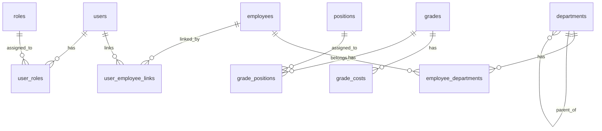

# ER図 (Entity Relationship Diagram)

## エンティティ関連図



## エンティティ詳細

### users（ユーザーマスター）

```
id: BIGINT (PK, GENERATED BY DEFAULT AS IDENTITY)
idp_subject: VARCHAR(255) (UK, NOT NULL)
email: VARCHAR(255) (UK, NOT NULL)
name: VARCHAR(100) (NOT NULL)
timezone: VARCHAR(50) (NOT NULL, DEFAULT 'Asia/Tokyo')
version: BIGINT (NOT NULL, DEFAULT 0)
status: VARCHAR(50) (NOT NULL, DEFAULT 'ENABLED') [UserStatus]
created_by: BIGINT (NOT NULL, DEFAULT 0)
created_at: TIMESTAMP WITH TIME ZONE (NOT NULL, DEFAULT CURRENT_TIMESTAMP)
updated_by: BIGINT (NOT NULL, DEFAULT 0)
updated_at: TIMESTAMP WITH TIME ZONE (NOT NULL, DEFAULT CURRENT_TIMESTAMP)
```

### departments（部署マスター）

```
code: VARCHAR(50) (PK)
parent_department_code: VARCHAR(50) (FK, Nullable)
name: VARCHAR(100) (NOT NULL)
description: VARCHAR(500)
sort_order: INTEGER
level: INTEGER
path: VARCHAR(1000)
version: BIGINT (NOT NULL, DEFAULT 0)
status: VARCHAR(50) (NOT NULL, DEFAULT 'ENABLED') [DepartmentStatus]
created_by: BIGINT (NOT NULL, DEFAULT 0)
created_at: TIMESTAMP WITH TIME ZONE (NOT NULL, DEFAULT CURRENT_TIMESTAMP)
updated_by: BIGINT (NOT NULL, DEFAULT 0)
updated_at: TIMESTAMP WITH TIME ZONE (NOT NULL, DEFAULT CURRENT_TIMESTAMP)
```

### employees（従業員マスター）

```
employee_number: VARCHAR(50) (PK)
name: VARCHAR(100) (NOT NULL)
version: BIGINT (NOT NULL, DEFAULT 0)
status: VARCHAR(50) (NOT NULL, DEFAULT 'ENABLED') [EmployeeStatus]
created_by: BIGINT (NOT NULL, DEFAULT 0)
created_at: TIMESTAMP WITH TIME ZONE (NOT NULL, DEFAULT CURRENT_TIMESTAMP)
updated_by: BIGINT (NOT NULL, DEFAULT 0)
updated_at: TIMESTAMP WITH TIME ZONE (NOT NULL, DEFAULT CURRENT_TIMESTAMP)
```

### employee_departments（従業員部署関連）

```
id: BIGINT (PK, GENERATED BY DEFAULT AS IDENTITY)
employee_number: VARCHAR(50) (FK, NOT NULL)
department_code: VARCHAR(50) (FK, NOT NULL)
is_primary: BOOLEAN (NOT NULL, DEFAULT false)
version: BIGINT (NOT NULL, DEFAULT 0)
created_by: BIGINT (NOT NULL, DEFAULT 0)
created_at: TIMESTAMP WITH TIME ZONE (NOT NULL, DEFAULT CURRENT_TIMESTAMP)
updated_by: BIGINT (NOT NULL, DEFAULT 0)
updated_at: TIMESTAMP WITH TIME ZONE (NOT NULL, DEFAULT CURRENT_TIMESTAMP)
```

### roles（ロールマスター）

```
code: VARCHAR(50) (PK)
name: VARCHAR(100) (NOT NULL)
description: VARCHAR(500)
version: BIGINT (NOT NULL, DEFAULT 0)
status: VARCHAR(50) (NOT NULL, DEFAULT 'ENABLED') [RoleStatus]
created_by: BIGINT (NOT NULL, DEFAULT 0)
created_at: TIMESTAMP WITH TIME ZONE (NOT NULL, DEFAULT CURRENT_TIMESTAMP)
updated_by: BIGINT (NOT NULL, DEFAULT 0)
updated_at: TIMESTAMP WITH TIME ZONE (NOT NULL, DEFAULT CURRENT_TIMESTAMP)
```

### user_roles（ユーザーロール関連）

```
user_id: BIGINT (PK, FK, NOT NULL)
role_code: VARCHAR(50) (PK, FK, NOT NULL)
version: BIGINT (NOT NULL, DEFAULT 0)
created_by: BIGINT (NOT NULL, DEFAULT 0)
created_at: TIMESTAMP WITH TIME ZONE (NOT NULL, DEFAULT CURRENT_TIMESTAMP)
updated_by: BIGINT (NOT NULL, DEFAULT 0)
updated_at: TIMESTAMP WITH TIME ZONE (NOT NULL, DEFAULT CURRENT_TIMESTAMP)
```

### grades（等級マスター）

```
code: VARCHAR(20) (PK, NOT NULL)
grade: VARCHAR(10) (NOT NULL)
branch_number: INTEGER (NOT NULL)
version: BIGINT (NOT NULL, DEFAULT 0)
status: VARCHAR(50) (NOT NULL, DEFAULT 'ENABLED') [GradeStatus]
created_by: BIGINT (NOT NULL, DEFAULT 0)
created_at: TIMESTAMP WITH TIME ZONE (NOT NULL, DEFAULT CURRENT_TIMESTAMP)
updated_by: BIGINT (NOT NULL, DEFAULT 0)
updated_at: TIMESTAMP WITH TIME ZONE (NOT NULL, DEFAULT CURRENT_TIMESTAMP)
```

### grade_costs（等級原価条件）

```
grade_code: VARCHAR(20) (PK, FK, NOT NULL)
fiscal_year: INTEGER (PK)
monthly_cost: NUMERIC
hourly_overtime_premium: NUMERIC
target_monthly_profit: NUMERIC
created_by: BIGINT (NOT NULL, DEFAULT 0)
created_at: TIMESTAMP WITH TIME ZONE (NOT NULL, DEFAULT CURRENT_TIMESTAMP)
updated_by: BIGINT (NOT NULL, DEFAULT 0)
updated_at: TIMESTAMP WITH TIME ZONE (NOT NULL, DEFAULT CURRENT_TIMESTAMP)
```

### positions（役職マスター）

```
code: VARCHAR(50) (PK)
name: VARCHAR(100) (NOT NULL)
description: VARCHAR(500)
version: BIGINT (NOT NULL, DEFAULT 0)
status: VARCHAR(50) (NOT NULL, DEFAULT 'ENABLED') [PositionStatus]
created_by: BIGINT (NOT NULL, DEFAULT 0)
created_at: TIMESTAMP WITH TIME ZONE (NOT NULL, DEFAULT CURRENT_TIMESTAMP)
updated_by: BIGINT (NOT NULL, DEFAULT 0)
updated_at: TIMESTAMP WITH TIME ZONE (NOT NULL, DEFAULT CURRENT_TIMESTAMP)
```

### grade_positions（等級役職関連）

```
grade_code: VARCHAR(20) (PK, FK, NOT NULL)
position_code: VARCHAR(50) (PK, FK, NOT NULL)
version: BIGINT (NOT NULL, DEFAULT 0)
created_by: BIGINT (NOT NULL, DEFAULT 0)
created_at: TIMESTAMP WITH TIME ZONE (NOT NULL, DEFAULT CURRENT_TIMESTAMP)
updated_by: BIGINT (NOT NULL, DEFAULT 0)
updated_at: TIMESTAMP WITH TIME ZONE (NOT NULL, DEFAULT CURRENT_TIMESTAMP)
```

### user_employee_links（ユーザー従業員関連）

```
user_id: BIGINT (PK, FK, NOT NULL)
employee_number: VARCHAR(50) (PK, FK, NOT NULL)
version: BIGINT (NOT NULL, DEFAULT 0)
created_by: BIGINT (NOT NULL, DEFAULT 0)
created_at: TIMESTAMP WITH TIME ZONE (NOT NULL, DEFAULT CURRENT_TIMESTAMP)
updated_by: BIGINT (NOT NULL, DEFAULT 0)
updated_at: TIMESTAMP WITH TIME ZONE (NOT NULL, DEFAULT CURRENT_TIMESTAMP)
```
