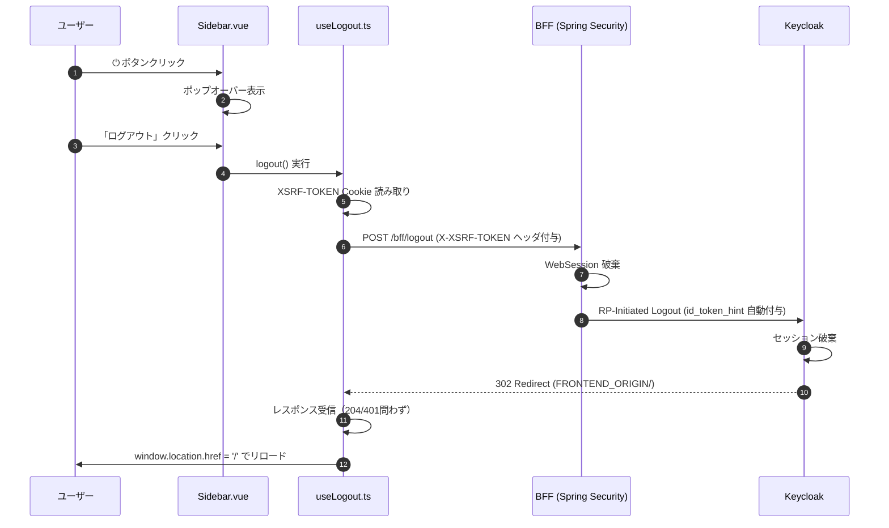

# ログアウト機能 詳細設計書

## 1. 概要

### 目的

フロントエンド（Nuxt 4）にログアウト機能を提供し、ユーザーが自身のセッションを安全に終了できるようにする。

### スコープ

- **対象**: `frontend/app/components/Sidebar.vue`、`frontend/app/composables/useLogout.ts`、`frontend/app/layouts/default.vue`
- **対象外**: BFF の `/logout` 実装（Spring Security 標準機能に依存）、Keycloak の設定

## 2. UI設計

### サイドバー構成

- **フッター**: 左からアバタ（`山田`）、ユーザー名（`山田 太郎`）、ロール（`管理者`）、⏻ ボタン
- **⏻ ボタン**:
  - 位置: フッター右端
  - ホバー効果: `#64748b` → `#94a3b8`
  - クリック: ポップオーバー表示/非表示 トグル

### ポップオーバー

- **配置**: `absolute`, `bottom-14`, `right-4`
- **サイズ**: `w-40`
- **スタイル**: `rounded-md`, `shadow-lg`, `bg-[#1e293b]`, `z-index: 60`
- **項目**:
  - 「ログアウト」1項目（アイコン: `→`）
  - クリックで `useLogout()` 実行
- **閉じる条件**:
  - 外側クリック（`@mouseleave` 簡易版）
  - メニュー項目クリック後
  - Escape キー（今回は未実装、将来拡張）

## 3. 認証フロー

### ログアウトシーケンス



### CSRF対策

- **Cookie名**: `XSRF-TOKEN`（`HttpOnly: false`、`SameSite: Lax`）
- **ヘッダ名**: `X-XSRF-TOKEN`
- **実装**: `document.cookie` から `XSRF-TOKEN` を抽出し、POST リクエストのヘッダに設定

### エラーハンドリング

- **204 No Content**: ログアウト成功 → `window.location.href = '/'`
- **401 Unauthorized**: セッション切れ等 → `window.location.href = '/'`
- **ネットワークエラー**: catch ブロック → `window.location.href = '/'`
- いずれの場合もフロントエンドトップへリロードし、未認証状態を確実にリセット

## 4. 実装詳細

### composable: `useLogout.ts`

```typescript
import { createBffAuthClient } from './useBffAuthClient';

export function useLogout() {
  const config = useRuntimeConfig();
  const client = createBffAuthClient(config.public.bffOrigin, { credentials: 'include' });

  async function logout() {
    try {
      const csrf = getCookie('XSRF-TOKEN') ?? '';
      const { error } = await client.post('/bff/logout', {
        headers: { 'X-XSRF-TOKEN': csrf },
      });
      window.location.href = '/';
    } catch {
      window.location.href = '/';
    }
  }

  return { logout };
}
```

### コンポーネント: `Sidebar.vue`

- **Props**: `currentPage: SamplePage`
- **Emits**: `navigate: [page: SamplePage]`
- **状態管理**: `showLogoutMenu` (ref<boolean>)
- **主要メソッド**:
  - `handleLogout()`: ポップオーバーを閉じ、`useLogout()` 実行

### レイアウト統合

- `frontend/app/layouts/default.vue` で `<Sidebar />` を参照
- `SampleSidebar` は編集しない

## 5. テスト計画

### コンポーネントテスト: `Sidebar.spec.ts`

- **テストケース**:
  1. 初期表示時にポップオーバーが表示されていないこと
  2. ⏻ ボタンクリックでポップオーバーが表示されること
  3. 「ログアウト」クリックで `useLogout` が呼ばれること
  4. 外側クリック（簡易版）でポップオーバーが閉じること

### Composable テスト: `useLogout.spec.ts`

- **テストケース**:
  1. `POST /bff/logout` が呼び出されること
  2. `X-XSRF-TOKEN` ヘッダに Cookie 値が設定されること
  3. 204 受信時に `window.location.href` が `/` になること
  4. エラー時も `window.location.href` が `/` になること

## 6. 関連ドキュメント

- `docs/auth/oidc_flow.md` — OIDC認証フロー全体仕様
- `frontend/openapi/bff-auth.yaml` — BFF Auth API 定義
- `frontend/app/composables/useBffAuthClient.ts` — 既存の認証クライアント
